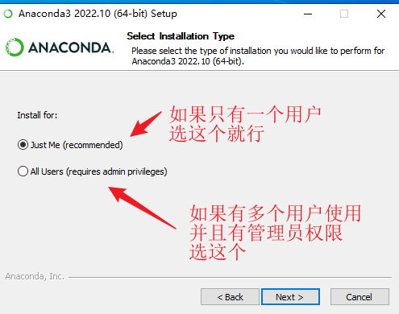
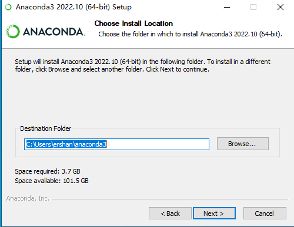
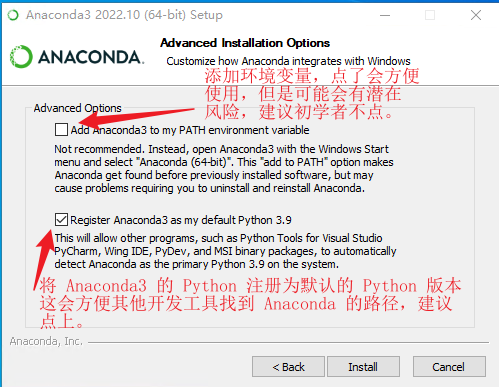
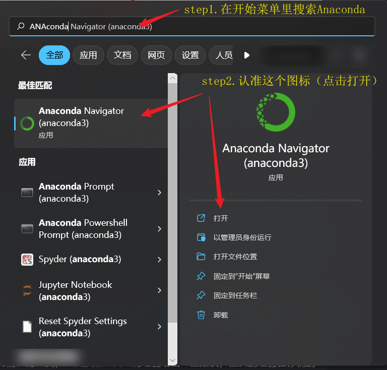

tags:: 基础笔记
title:: Anaconda

-
- ## What
	- Anaconda 是一个用于科学计算的开源软件包，提供了一个可以管理和部署多版本科学软件的环境。Anaconda 可以从 [Anaconda.org](https://anaconda.org/) 下载。
- ## Why
	- Anaconda 是一个用于科学计算的 Python 发行版，它包含了许多用于数据分析、机器学习和其他科学计算领域的常用包。
	- 使用 Anaconda 的优点之一是==它可以让用户轻松地在自己的系统上安装这些常用包，并且还可以方便地管理多个不同的包集合（称为虚拟环境）==，以便在不同的项目中使用不同的包版本。
	- 另外，Anaconda 还提供了一个可视化工具（Anaconda Navigator），可以让用户通过图形界面来管理安装的包和环境。因此，使用 Anaconda 可以为用户提供一个统一的、便捷的平台，让用户能够更快速地开始进行科学计算。
- ## How
	- ### 下载和安装 Anaconda
		- 1. 访问 Anaconda 的官方网站，https://www.anaconda.com/，并下载安装程序。
		  {:height 514, :width 579}
		- 2. 打开下载的安装程序并按照屏幕上的提示进行操作。遇到选择安装[[用户]]按照如下提示操作：
		  
		- 3. 点击 Next 选择安装路径，通常安装到默认位置即可，如果安装到其他位置，请记住该安装路径。
		  
		- 4. 选择是否添加 Anaconda 到环境变量并注册其为默认的 Python 解释器：
		  
		- 5. 安装完成后，您可以在 Windows 开始菜单中找到 Anaconda Navigator 图标，点击该图标打开 Anaconda Navigator。
		- {:height 505, :width 581}
	- ###
-