-
- [[IDLE]] 是按照 Python 是默认的**集成开发与学习环境**。所以它和传统意义上的开发环境不同，它其实更侧重于**学习**。
- 具体而言：
	- 它只适合一次编辑运行一个文件，对于多个源文件组成的项目略显乏力。
	- 它的语法高亮，自动补全等功能都比较弱，不如现代 IDE 那么智能。
	- 那么它的优点在哪里呢？其实对于初学者来说显而易见，那就是==开箱即用，不需要额外安装配置更复杂的环境==。
	- 但同样的，面对简洁的就跟记事本一样的编辑界面，大家上手的时候可能也会觉得手足无措。
- 下面我们就简单来学习一下 IDLE 的使用，使用它足够我们学习完 Python 的基础语法部分了。
- ## 使用 IDLE
	- Step 1. 按下win键打开开始菜单，输入idle进行搜索
	- 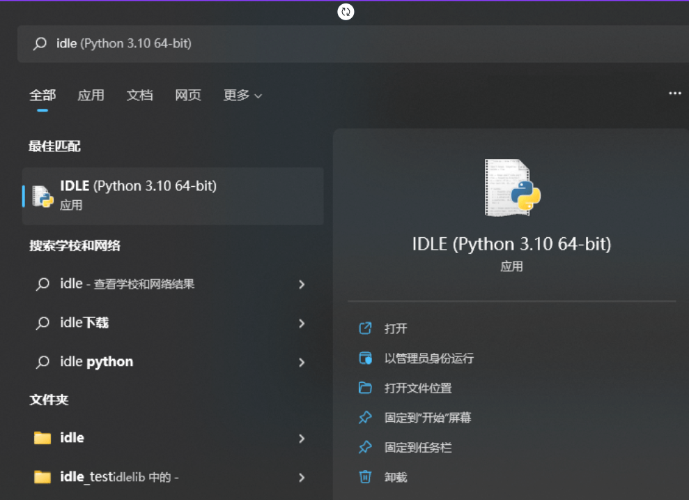
	- step 2. 鼠标左键点击打开，或者按回车也行，注意这里一定是搜出来的**应用**才可以点击打开
	- Step 3. [[IDLE]] 的 [[交互式模式]]
	- 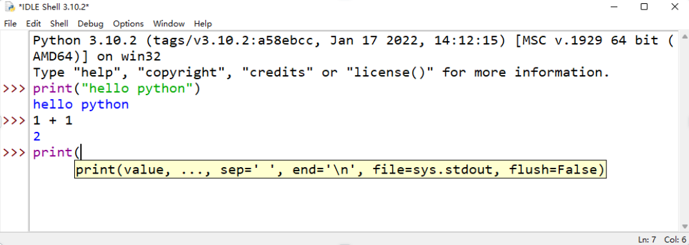
	- 其实这里的内容和我们在cmd里看到的内容大同小异，我们把cmd称为 [[终端界面]] 或者也叫 [[命令行界面]] ，把IDLE这种称为 [[图形化界面]] 。
	- 不过 [[IDLE]] 的交互式模式会更加的智能，例如这里我们输入print的时候出现了一些提示，告诉我们如何使用print这个函数。
	- Step 4. IDLE的文本编辑模式
	- 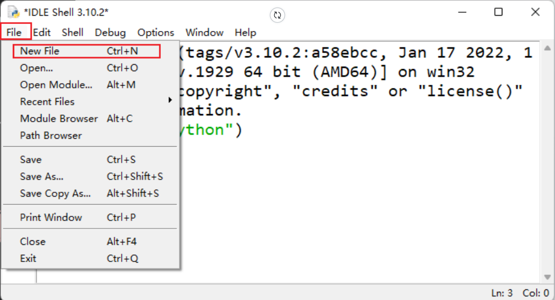
	- 点击 `File > New File`，或者直接按快捷键 `Ctrl + N` 会打开一个新的窗口。我们在新窗口的编辑区域输入程序语句 `print("hello idle")`。
	- 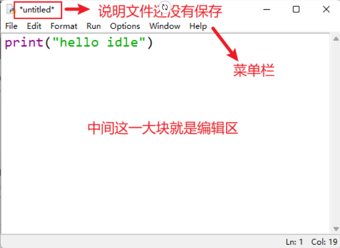
	- 点击 `File > Save`，或者直接按快捷键 `Ctrl + S` 保存文件，如果文件带 `*` 并且是 `untitled`，会弹出来一个新的窗口，让我们选择文件保存的位置，选择好 [[文件路径]] 后点击保存。
	- 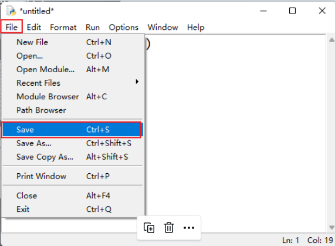
	- 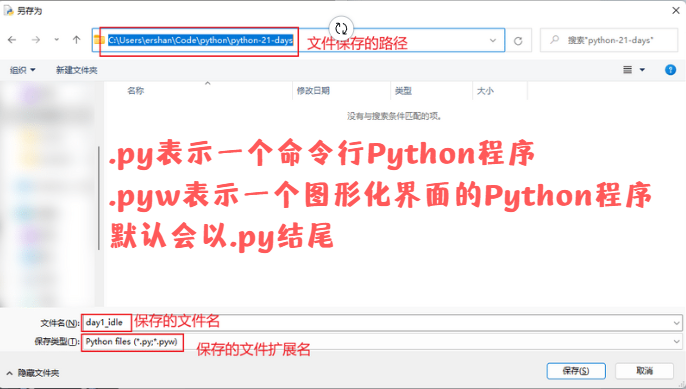
	- 我们到保存好的位置就可以看到一个以 `.py` 结尾的文件了。
	- 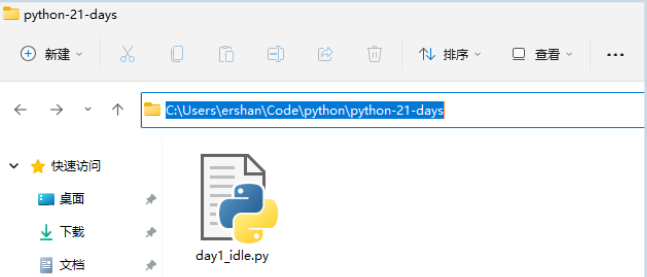
	- 点击 `Run > Run Module` 或者按快捷键 `F5` 就可以运行我们的程序啦。
	- 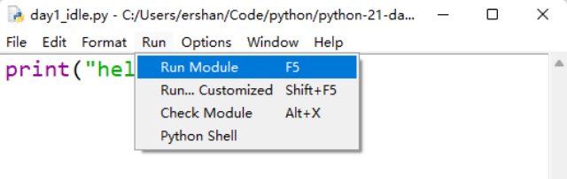
	- 运行结果：
	- 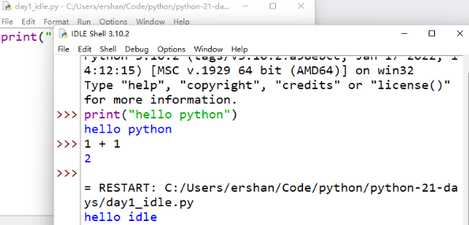
- ## 简单配置
	- 点击 `Options -> Configure IDLE` 可以对 `IDLE` 进行简单配置：
	- 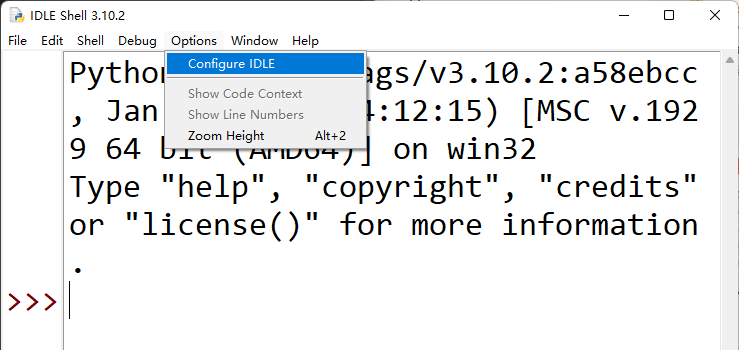
	- ### 设置==字体，字号==：
	- 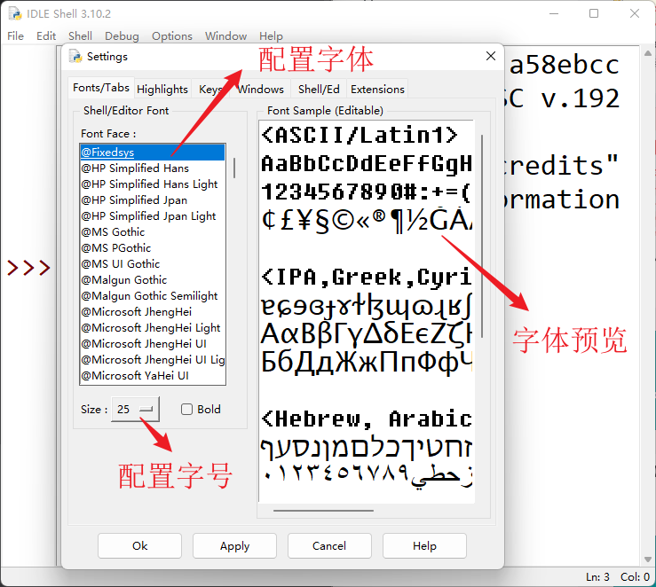
	- 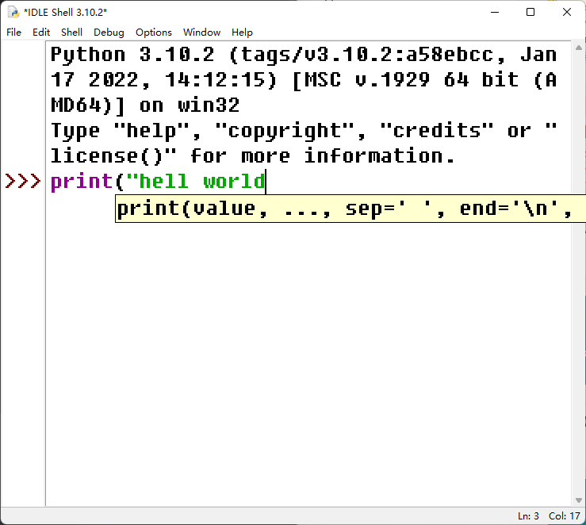
	- 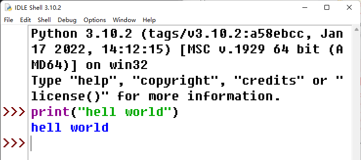
	- ### 更改主题和配色
		- 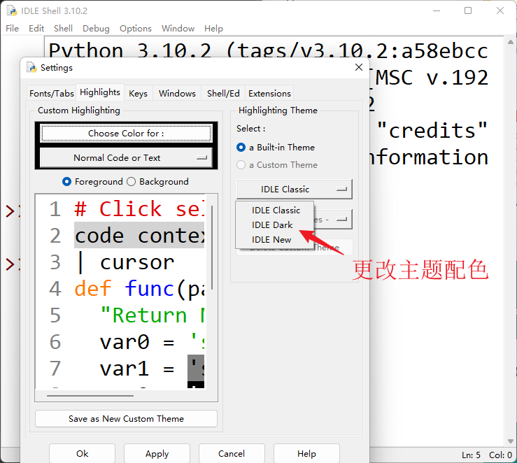
		- 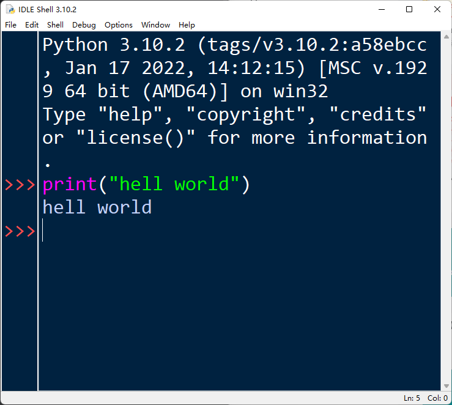
-