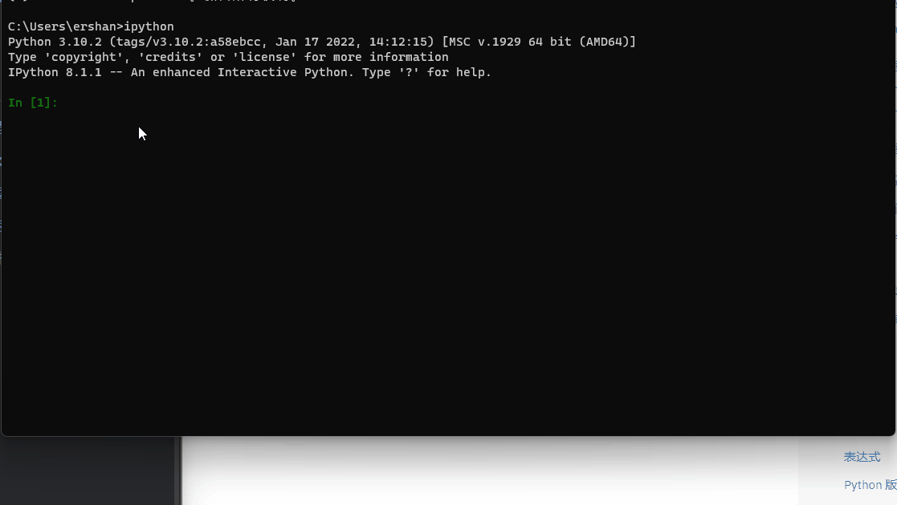
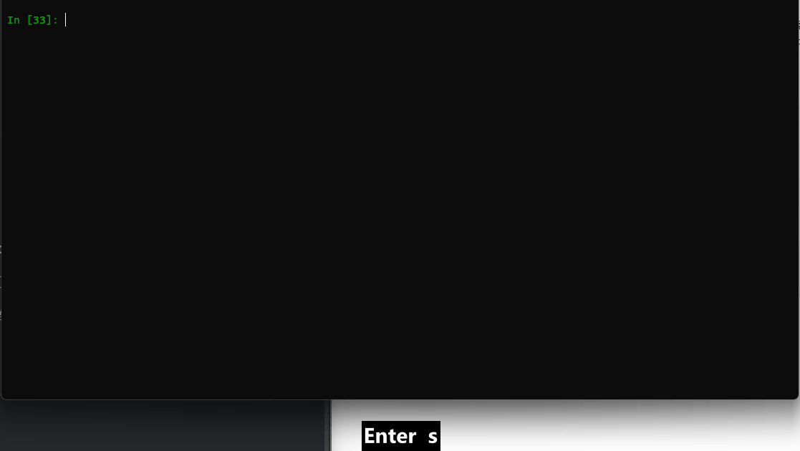
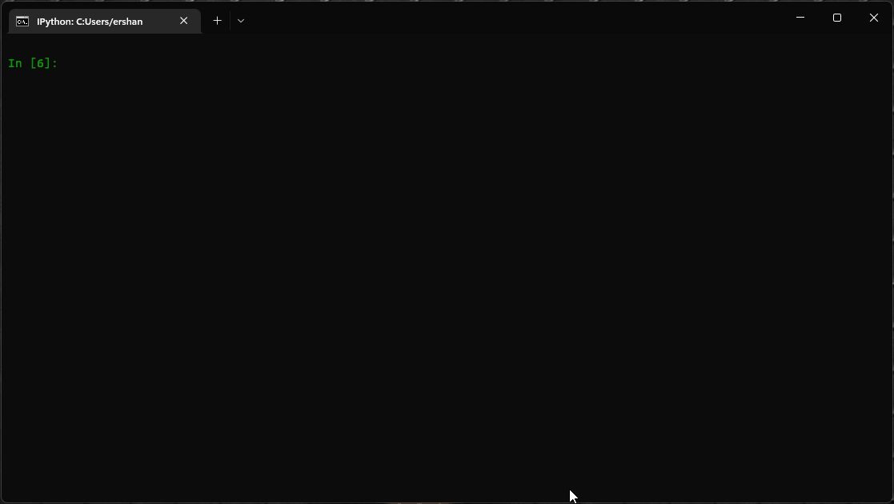

- 原生的 [[Python Shell]] 实在太过简陋，并不是学习的好工具。这里推荐大家使用增强版的 IPython。
- ## 安装 IPython
	- 使用 `pip` 直接安装即可：
		- ```sh
		  pip install ipython
		  ```
- ## 使用 IPython
	- 在终端里直接输入 `ipython` 运行即可：
		- ```sh
		  > ipython
		  Python 3.9.13 (main, Oct 13 2022, 21:15:33)
		  Type 'copyright', 'credits' or 'license' for more information
		  IPython 8.6.0 -- An enhanced Interactive Python. Type '?' for help.
		  
		  In [1]:
		  ```
	- ### 获取帮助
		- 在 `ipython` 中可以使用 `?object` 的方式获取 `object` 的帮助文档：
			- 
		- 使用 `??object` 可以获取更详细的文档
	- ### 执行命令行命令
		- 在 `ipython` 中可以使用 `!command` 的形式运行命令行命令，例如 `!echo`：
			- ```python
			  In [1]: !echo hello
			  hello
			  ```
	- ### 自动补全
		- 可以使用 `tab` 键进行自动补全：
			- 
	- ### 获取历史语句
		- 使用 `ctrl + r` 搜索获取历史语句
			- 
	- ### Magic Methods
		- 使用 `timeit` 计算语句运行时间
			- ```python
			  In [2]: %timeit list()
			  23.4 ns ± 0.543 ns per loop (mean ± std. dev. of 7 runs, 10,000,000 loops each)
			  
			  In [3]: %timeit []
			  9.54 ns ± 0.284 ns per loop (mean ± std. dev. of 7 runs, 100,000,000 loops each)
			  ```
		- 使用 `alias` 给系统命令起别名
			- ```python
			  In [15]: %alias say echo
			  
			  In [16]: say hi
			  hi
			  ```
		- 使用 `bookmark` 管理地址
			- ```plaintext
			  In [20]: cd /mnt/c/Users/ershan/Documents/thepython/src/
			  /mnt/c/Users/ershan/Documents/thepython/src
			  
			  In [21]: %bookmark -l
			  Current bookmarks:
			  
			  In [22]: %bookmark?  # 查看 magic method 的帮助
			  Docstring:
			  Manage IPython's bookmark system.
			  
			  %bookmark <name>       - set bookmark to current dir
			  %bookmark <name> <dir> - set bookmark to <dir>
			  %bookmark -l           - list all bookmarks
			  %bookmark -d <name>    - remove bookmark
			  %bookmark -r           - remove all bookmarks
			  
			  You can later on access a bookmarked folder with::
			  
			    %cd -b <name>
			  
			  or simply '%cd <name>' if there is no directory called <name> AND
			  there is such a bookmark defined.
			  
			  Your bookmarks persist through IPython sessions, but they are
			  associated with each profile.
			  File:      ~/miniconda3/lib/python3.9/site-packages/IPython/core/magics/osm.py
			  
			  In [23]: %bookmark tpsrc  # 设置当前路径为名为 tpsrc 的书签
			  
			  In [24]: %bookmark -l     # 列出当前书签列表
			  Current bookmarks:
			  tpsrc -> /mnt/c/Users/ershan/Documents/thepython/src
			  
			  In [25]: %cd -b tpsrc     # 跳转到 tpsrc 书签
			  (bookmark:tpsrc) -> /mnt/c/Users/ershan/Documents/thepython/src
			  /mnt/c/Users/ershan/Documents/thepython/src
			  ```