tags:: 基础笔记
title:: Jupyter Notebook

- Jupyter Notebook 底层使用了 [[IPython]] 的内核，并再此基础上发展出了自己的生态。它最大的优势就是==可以把研究成果和代码一起打包、分发、传播==，因此广受学生群体和科研人员的青睐。
- ## 安装 Notebook
	- 使用 `pip` 安装即可
		- ```sh
		  pip install notebook
		  ```
- ## 使用 Notebook
	- ### 启动 `notebook`
		- 使用 `cd` 命令切换到要开启 `notebook` 的路径，输入 `jupyter notebook` 即可：
			- ```sh
			  C:\Users\ershan\Documents\thepython\src>jupyter notebook
			  ```
			- 使用该命令会基于该位置设置 `notebook` 的文件路径。
			- 然后使用浏览器访问 ` http://127.0.0.1:8888` 就可以打开使用 `notebook` 了。
			- 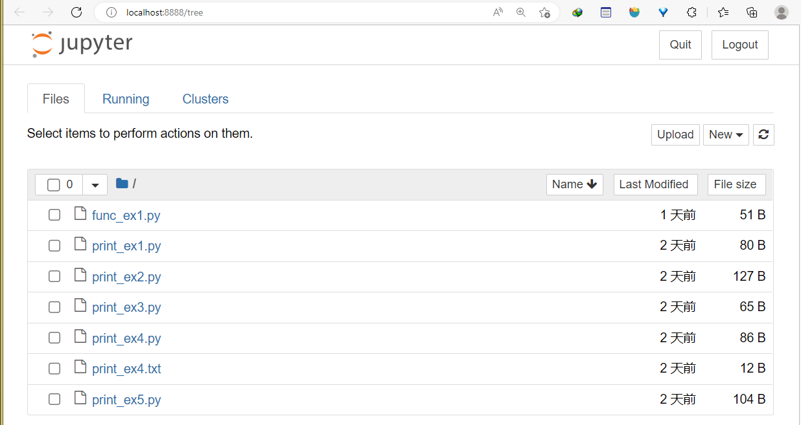
	- ### 创建新的 `notebook`
		- 点击 `new -> Python 3(ipykernel)` 创建新的 `notebook` 文件：
			- 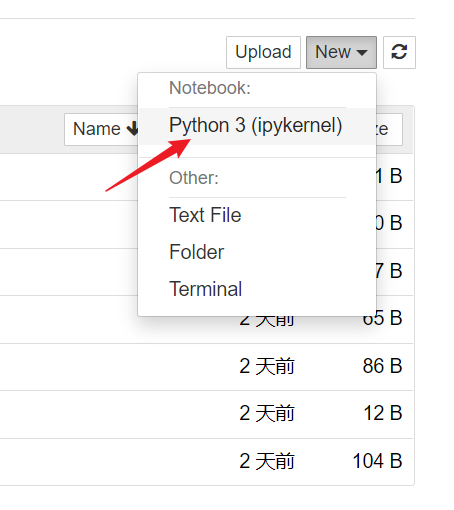
		- 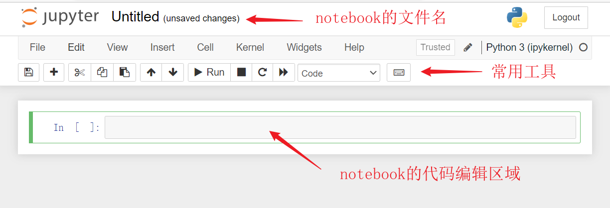
		- 点击文件名区域可以给文件重命名：
			- 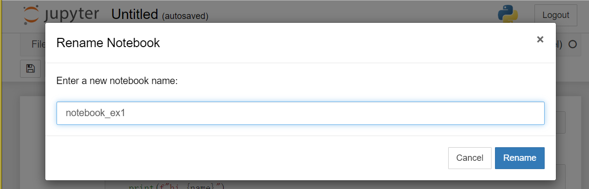
	- ### 使用 `notebook` 编写代码
		- `notebook` 中每一栏被称为一个 **Cell**，也叫做单元，默认情况下是代码单元，可以在里面编写 Python 的语句。
		- 
		- 每一个代码单元都可以独立的编写和运行。单元格内是程序语句，单元格下面是对应单元格的运行结果。
		- 常用快捷键：#notebook #shortcut
			- `esc`：按下 `esc` 进入命令模式，可以执行仿 `vim` 命令
			- `shift + enter`：运行当前代码并切换到下一个单元
			- `ctrl + enter`：只运行当前代码块不进行切换
			- `y`：在命令模式按下 `y` 可以将当前的单元切换为代码单元
		- `notebook` 基于 [[IPython]] 的内核，因此在 `IPython` 中能用的功能在 `notebook` 中均可以使用。
		- 使用 `tab` 进行自动补全：
			- 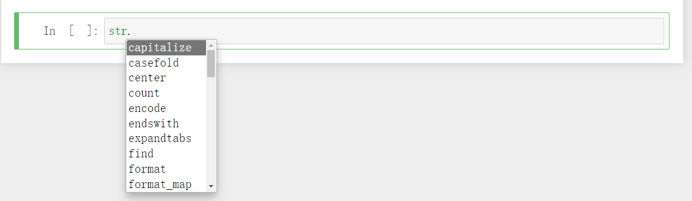
		- 使用 `?object` 查看对象的帮助文档：
			- 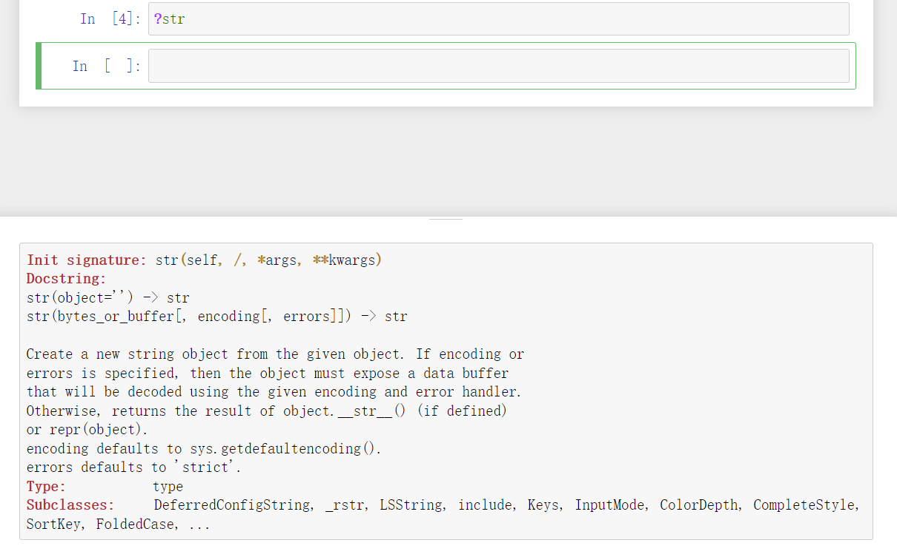
		- 魔法方法：
			- 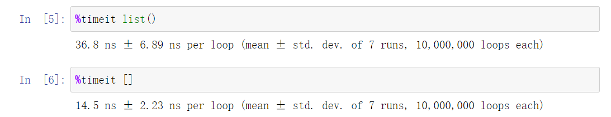
	- ### 使用 `notebook` 撰写文档
		- 除了代码单元，还要 `markdown` 单元，在里面我们可以使用 `markdown` 的语法撰写笔记和文档：
			- 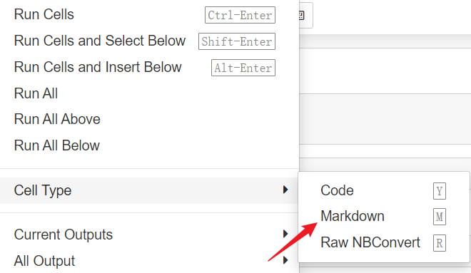
		- 使用 `markdown` 撰写文档的例子：
			- 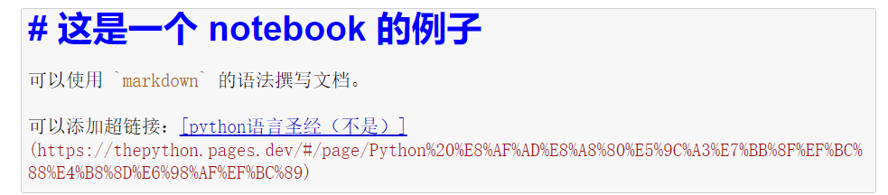
			- 按下 `ctrl + enter` 可以将其渲染成超文本的效果：
			- 
			-
		- 常用快捷键：#notebook #shortcut
			- `m`：在命令模式下使用 `m` 将当前单元切换成 `markdown` 单元。
		-
	- ### 在 `notebook` 中安装第三方库
		- 可以使用 `!pip` 直接在 `notebook` 的代码单元中安装第三方模块
		- 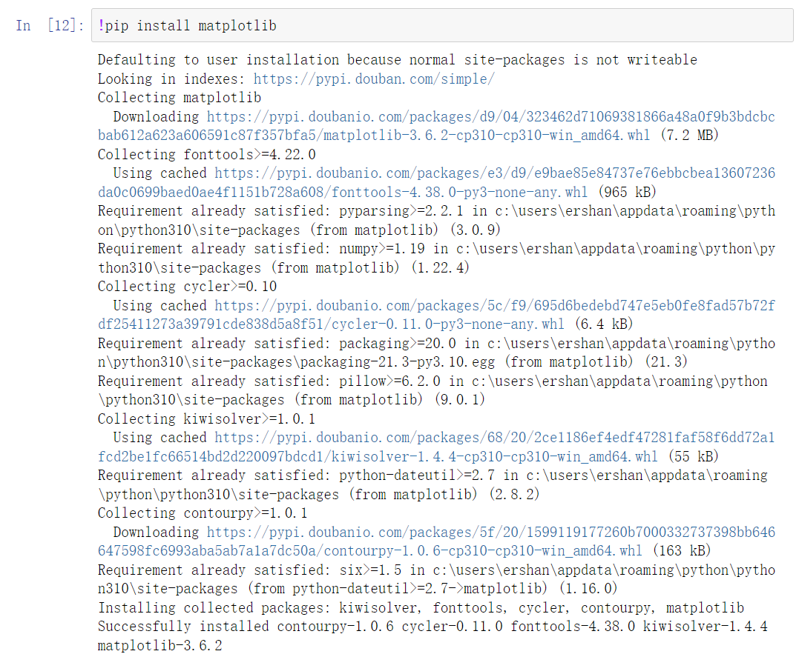
	- ### 在 `notebook` 中绘制并展示图片
		- 在上一部分我们安装了 Python 中的绘图库 [[matplotlib]]，这部分演示一下如何在 `notebook` 中绘制并展示图片。
		- 为了方便图片的展示，可以使用 `%matplotlib inline` 这个魔法方法，使用过后就不需要额外调用 `plt.show()` 方法来显示图片。
		- 绘制直线：
			- 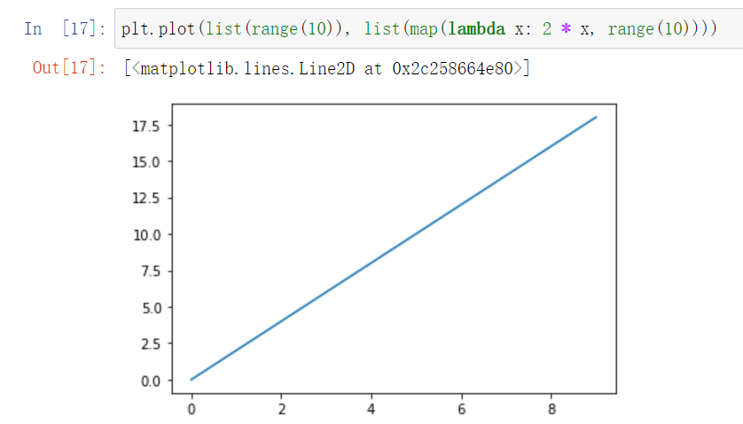
		- 绘制抛物线：
			- 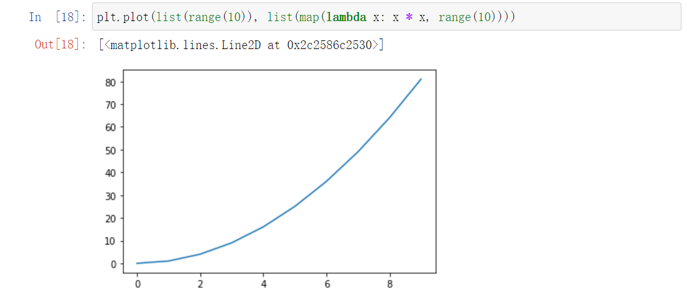
-