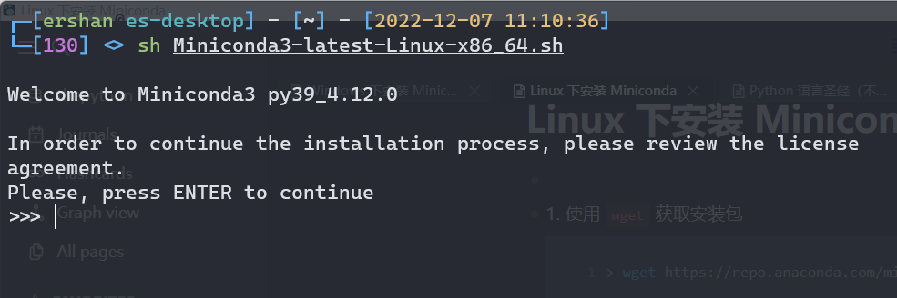
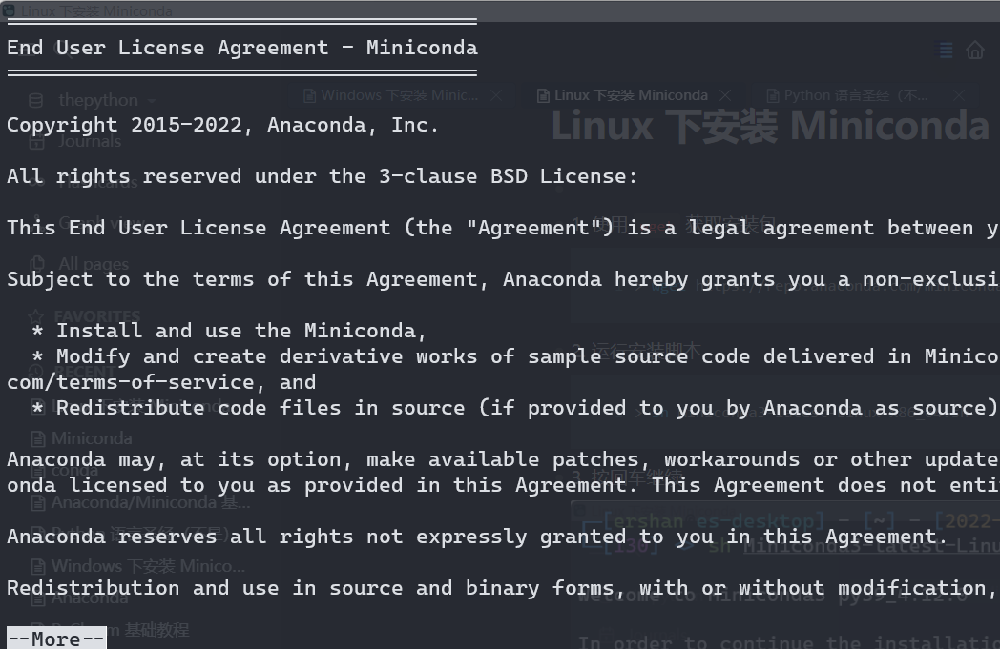
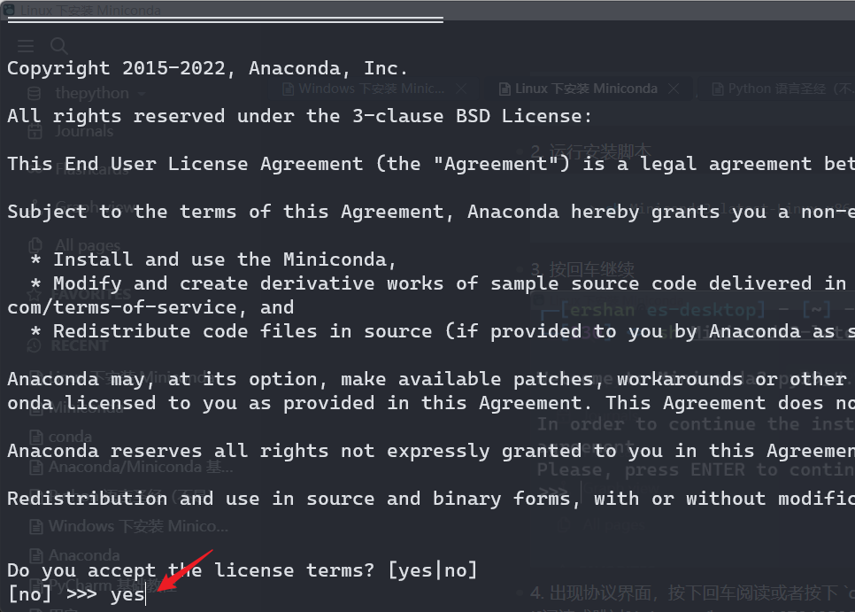
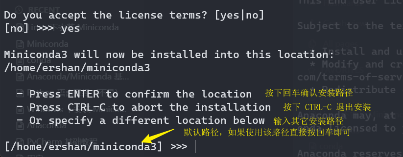

-
- 1. 使用 `wget` 获取安装包
  ```sh
  > wget https://repo.anaconda.com/miniconda/Miniconda3-latest-Linux-x86_64.sh
  ```
- 2. 运行安装脚本
  ```sh
  > sh Miniconda3-latest-Linux-x86_64.sh
  ```
- 3. 按回车继续
  
- 4. 出现协议界面，按下回车阅读或者按下 `q` 跳过，如果跳过输入 `yes` 按回车
  
  
- 选择安装路径，通常使用默认路径即可：
  
-