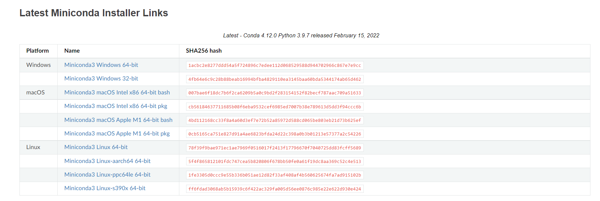

-
- ## What
	- > Miniconda 是 conda 的精简版安装程序。 它是 [[Anaconda]] 的小型引导程序版本，仅包含 conda，python，它们依赖的软件包以及少量其他有用的软件包，包括 pip，zlib 和其他一些软件包。 使用 `conda install command` 可以从 Anaconda 存储库中安装720+个其他 conda 软件包。
- ## Why
	- Miniconda 顾名思义更迷你，相比于打包了开发环境和工具的庞然大物 [[Anaconda]], [[Miniconda]] 只包含了 `conda`, `python` 和少量第三方库。
	- 对于入门数据分析或者机器学习的同学推荐使用 [[Anaconda]]，对于知道自己需要什么的熟练工推荐 [[Miniconda]]。
- ## How
	- ### 安装 Miniconda
	  collapsed:: true
		- 打开 Miniconda 的文档 [Miniconda — conda documentation](https://docs.conda.io/en/latest/miniconda.html) ，找到适合自己操作系统的 Minoconda 版本，点击下载：
		- 
			- {{embed [[Windows 下安装 Miniconda]]}}
			- {{embed [[Linux 下安装 Miniconda]]}}
	- ### 使用 Miniconda
		- Miniconda 只提供了命令行的接口，所以本质上也就是使用 Conda。
		- {{embed [[conda]]}}