-
- ## 安装
	- 搜索 PyCharm 或者直接点击这里打开官网 [PyCharm: the Python IDE for Professional Developers by JetBrains](https://www.jetbrains.com/pycharm/) 下载安装
	- 
	- 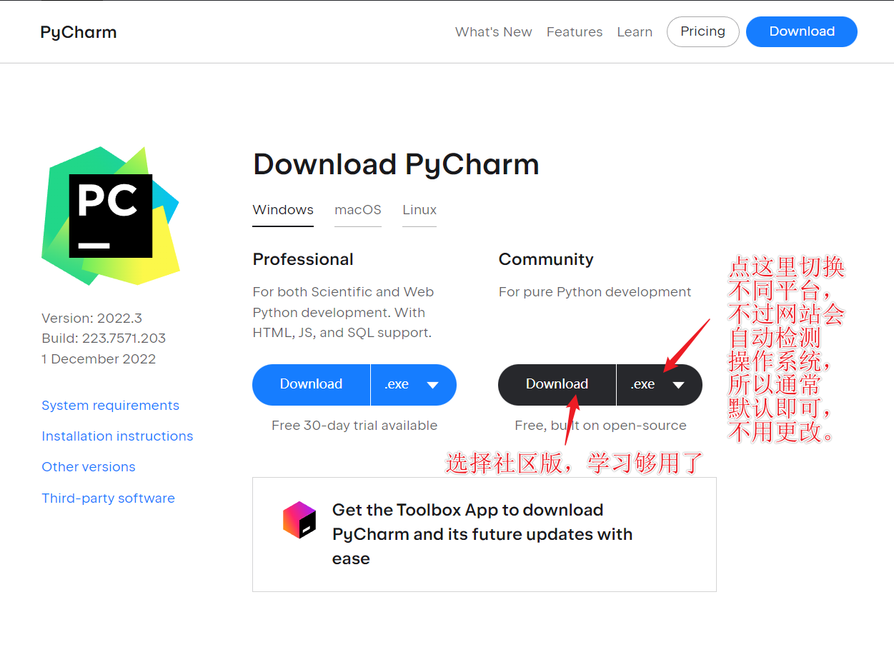{:height 573, :width 751}
	- 下载完成后双击打开安装包：
	- 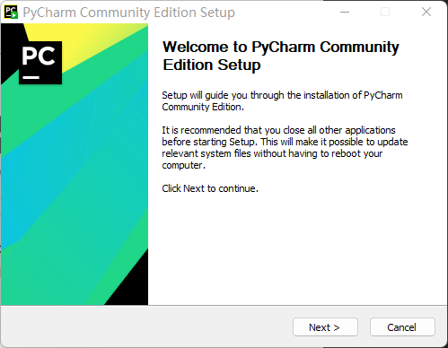
	- 选择安装路径：
	- 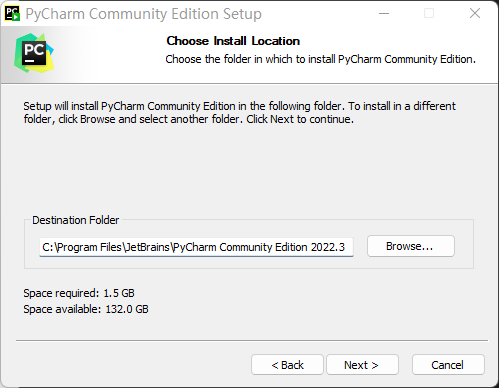
	- 选择安装选项：
	- 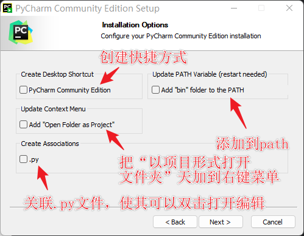
	- ==不清楚怎么选的话把前三个都选上==。
	- 然后一路 `next` 直到安装完成。
- ## 使用
	- 以项目形式打开源码目录：
	- 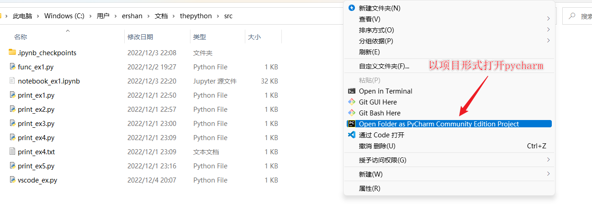
	- 新建一个文件：
	- 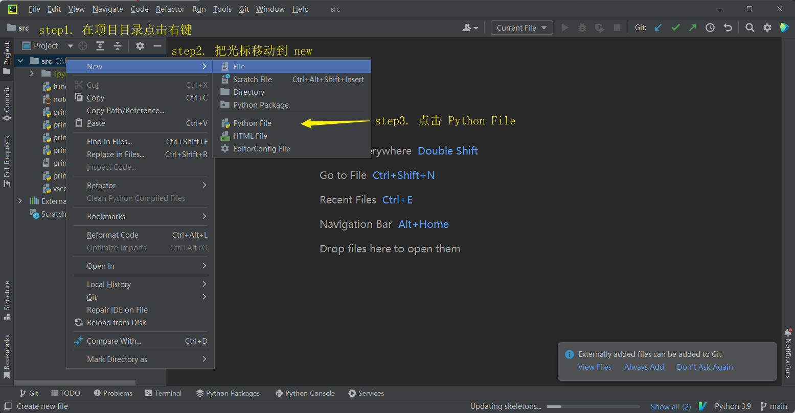
	- 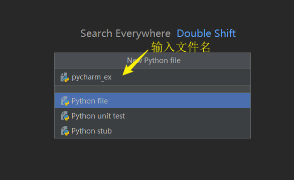
	- 输入文件名后双击 Python file 完成创建。
	- 然后在代码编辑区编写程序即可：
	- 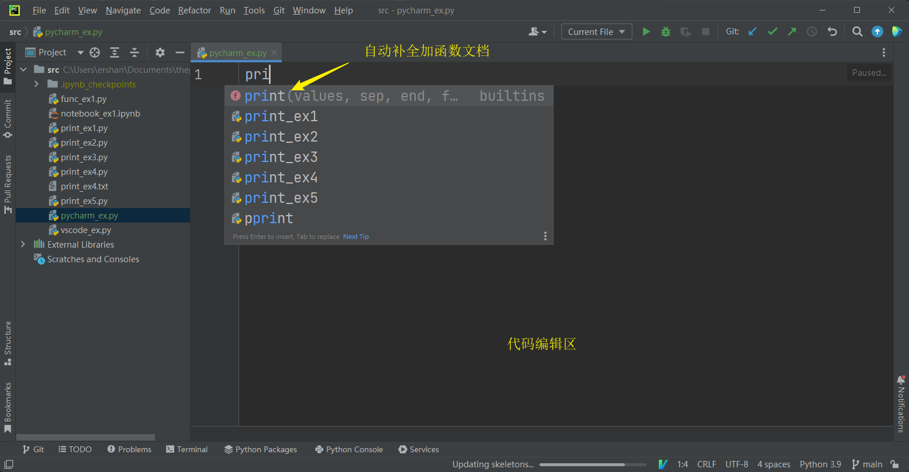
	- 编写并运行程序：
	- 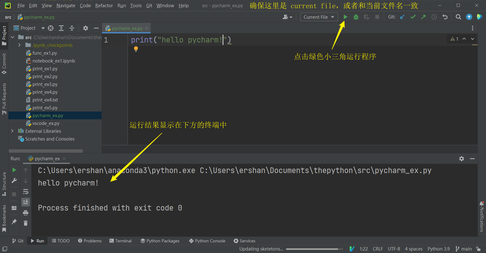
	- 或者在编辑区域点击右键选择 Run + 文件名运行：
		- 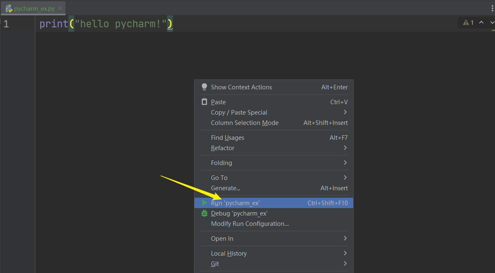
	- 常用快捷键：#shortcut #PyCharm
		- `Ctrl + Shift + F10`：运行当前文件。
		- `Shift + Shift`：命令面板
- ## 配置 Python 解释器
	- 点击 `File -> Settings`:
	- 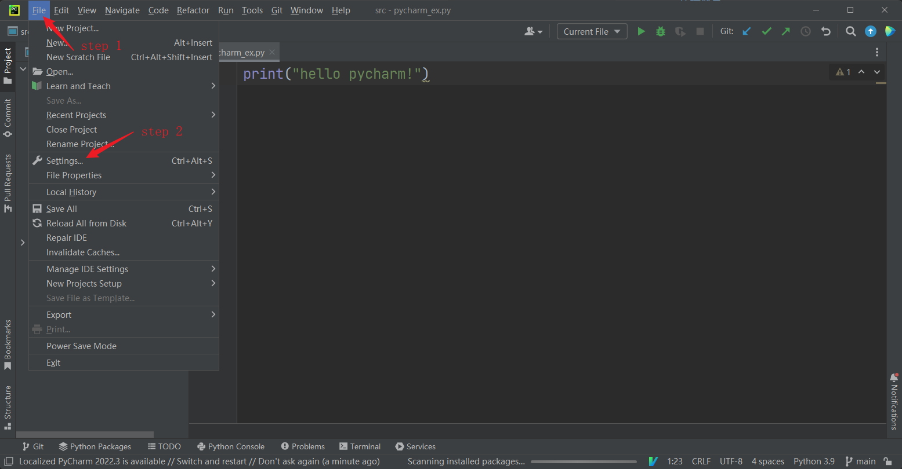
	- 设置解释器的方法：
	  step 1. 点击 Project
	  step 2. 点击 Python Interpreter
	  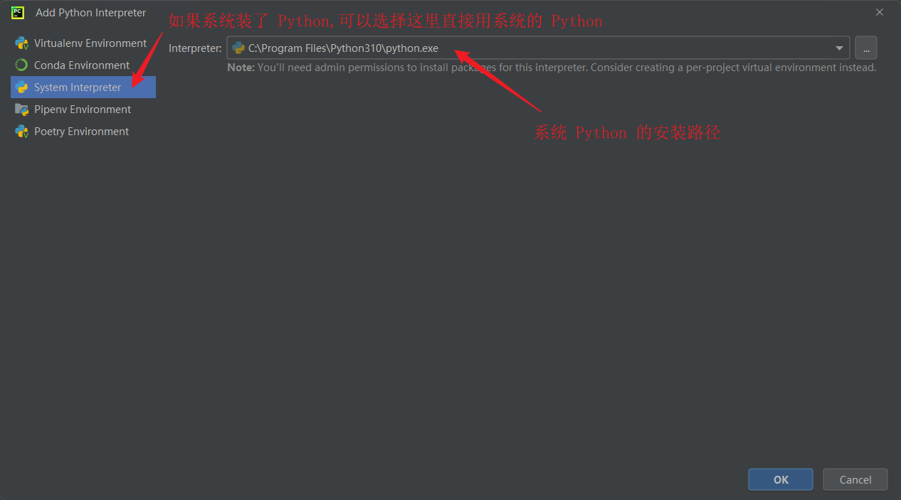 
	  关于虚拟环境的内容后文再表。
	  step 3. 点击 Add Interpreter
	  step 4. 点击下拉菜单选择解释器
	- 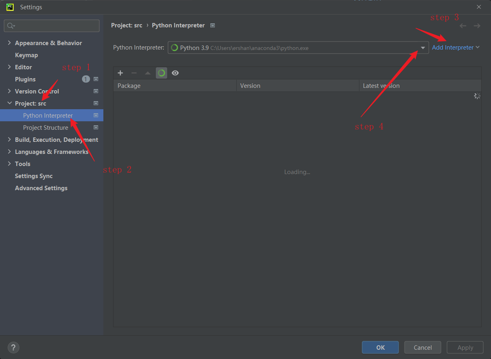
- ## 小结
	- 学完这一节希望你能够：
		- 1. 安装 PyCharm；
		- 2.  以项目的形式打开一个源码目录；
		- 3.  编写并运行 `hello world` 程序。