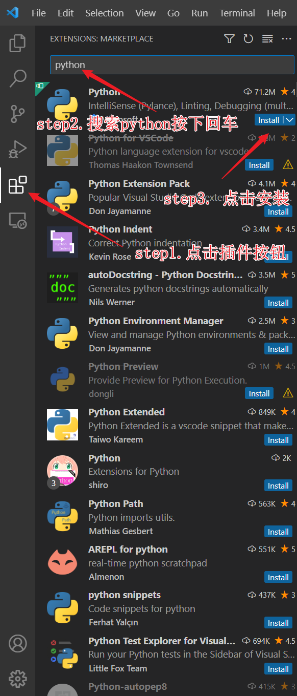

tags:: vscode extension, vscode 扩展

-
- 微软官方提供的 [[Python]] 语言扩展。
- ## 安装
	- 
- ## 使用简介
	- 首先确保是以**目录**的形式打开的 VSCode。
	- 
- 点击图标新建一个文件：
- 
- 
- 自动补全：
- 
- 显示函数的帮助文档：
- 
- 保存文件：
- 
- 点击右上角小三角运行程序：
- 
- 查看运行结果：
- 
-