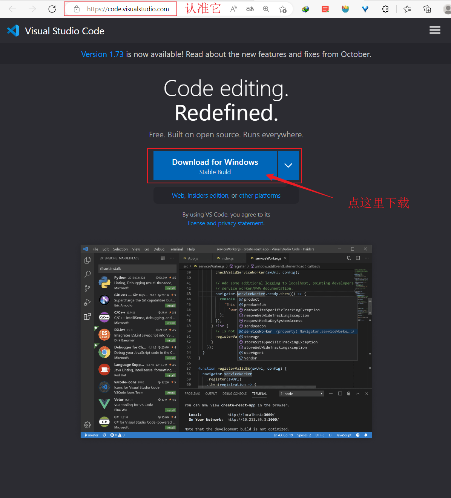
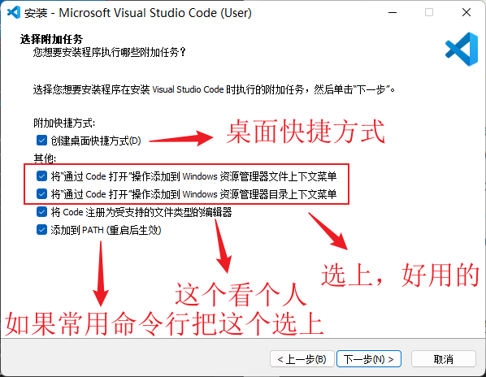

-
- 讲过了 [[IDLE]]，这部分我们再看看 [[VSCode]]。
- ## 安装 VSCode
	- 安装的过程可以参考如下视频：
		- {{video https://www.bilibili.com/video/BV1PN4y1L7KS?t=10.2}}
		- {{renderer :media-timestamp, 18}} 打开官网 [https://code.visualstudio.com/](https://code.visualstudio.com/)，认准这个网址，别被骗了 #beginner
			- 
		- {{renderer :media-timestamp, 61}} 下载安装包
		- {{renderer :media-timestamp, 1:05}} 开始安装
		- {{renderer :media-timestamp, 1:15}} 选项讲解
			- 
		- {{renderer :media-timestamp, 2:21}} 从命令行打开 vscode
		- {{renderer :media-timestamp, 2:50}} 在资源管理器中通过右键打开
- ## 安装 Python 扩展
	- VSCode 只是一个文本编辑器，想要使用它比较舒适的编写 Python 程序需要做两件事情：
		- 一件是确保你的本地已经安装好了 Python 解释器，并且把它添加到了环境变量中；
		- 另一件是需要安装一些插件，而其中必须要安装的就是微软官方的 [[Python扩展]] 啦。
	- {{embed [[Python扩展]]}}