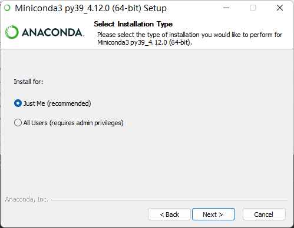
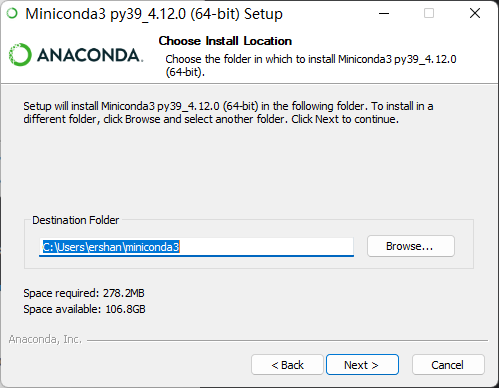
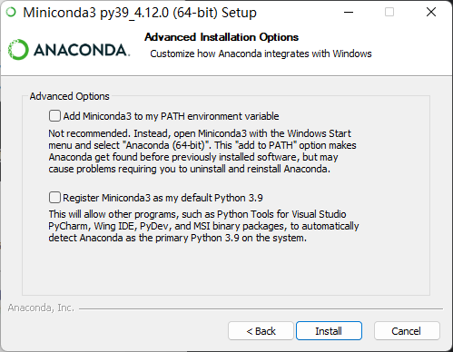

-
- 1. 双击打开 `.exe` 文件，例如我下载的是最新版：`Miniconda3-latest-Windows-x86_64.exe`。
- 2. 选择安装目录：
	- 
	  参考 Miniconda
	  ((f095471e-029c-47d8-aa2b-988b76053da2))
- 3. 选择安装路径：
	- 
	  参考 Anaconda
	  ((cfcad331-cb52-4f33-8843-330eb8ff7263))
- 4. 选择是否配置环境变量：
	- 
	  参考
	  ((638f2398-961f-47c2-a452-daa0ac14371a))
- 5. 点击 Install 等待安装完成
- 6. 点击开始菜单搜索 miniconda