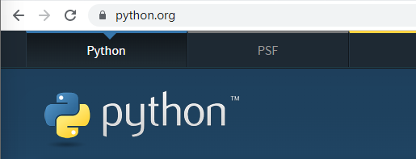
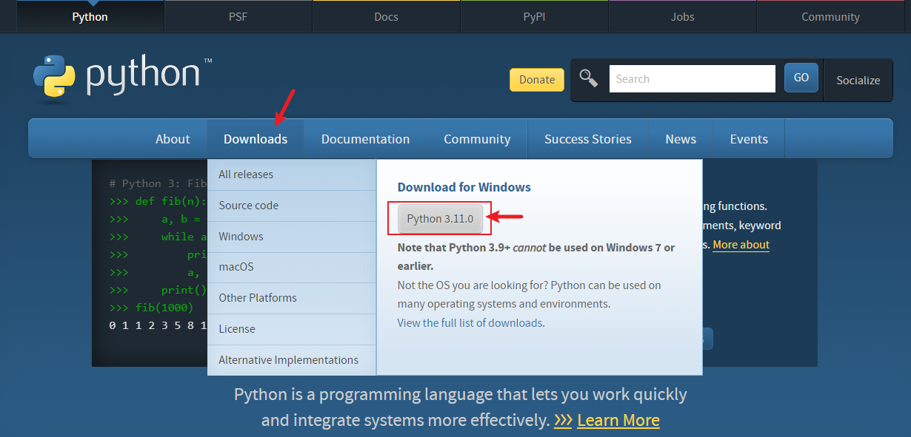
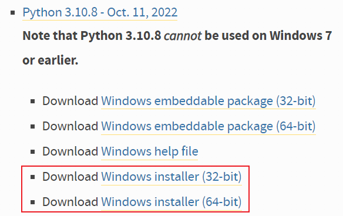

- Windows 下安装 Python 依赖当前操作系统的版本，具体可参考下表：
	- | windows | python |
	  | --- | --- |
	  | 8, 10, 11 | 可选择任意版本，学习用推荐 3.10 |
	  | 7 | < 3.9 |
	  | xp | < 3.4 |
- 具体安装流程如下：
	- Step 1. 打开浏览器输入 `https://www.python.org/`，或者直接点击[Python 官网](https://www.python.org/)
		- 
	- Step 2. 把鼠标放到 Downloads 处，这里会默认识别操作系统推荐相应的 Python 版本，如果没有特定需求，win8+ 用户直接通过此处下载即可。
		- 
	- Step 3. 如果 Step 2 不适用，点击 Downloads -> [Windows](https://www.python.org/downloads/windows/). 找到适合你的Python版本，选择方式参考上表。
		- 
		- 64位用户选择 64-bit，32位用户选择 32-bit
		- [[查看操作系统是 64 位还是 32 位的方法]]