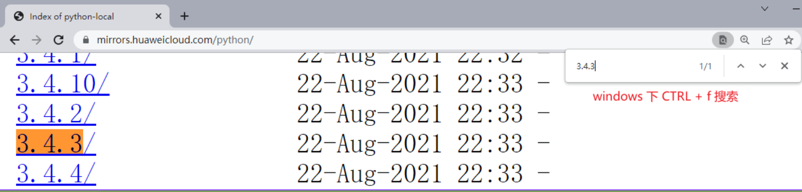
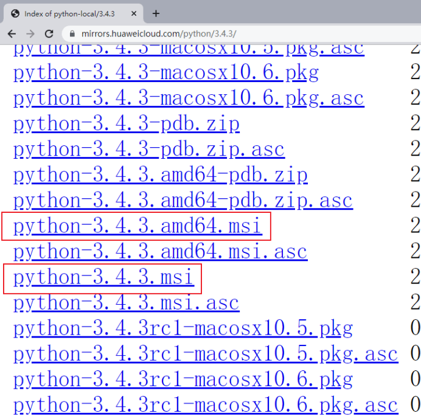
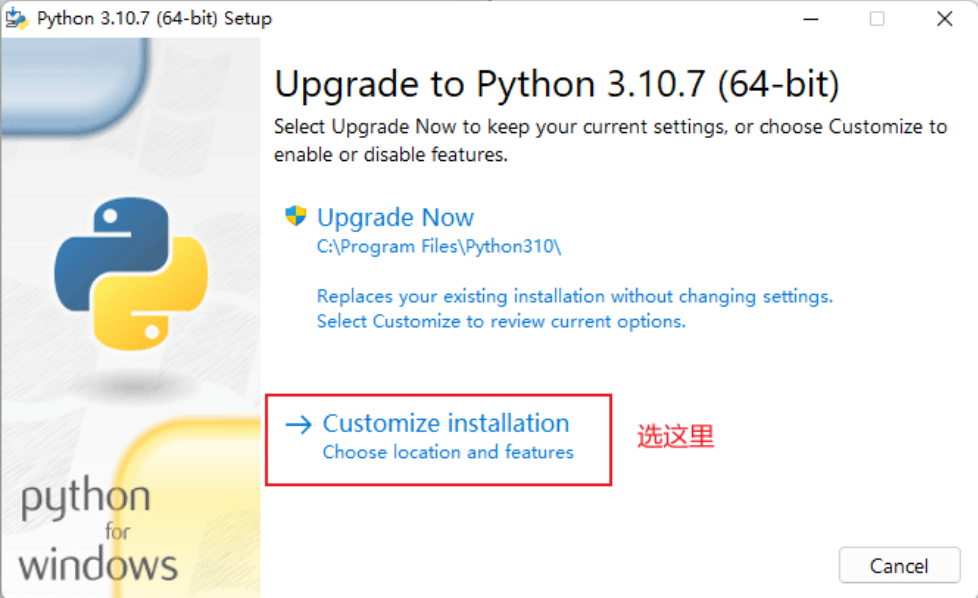
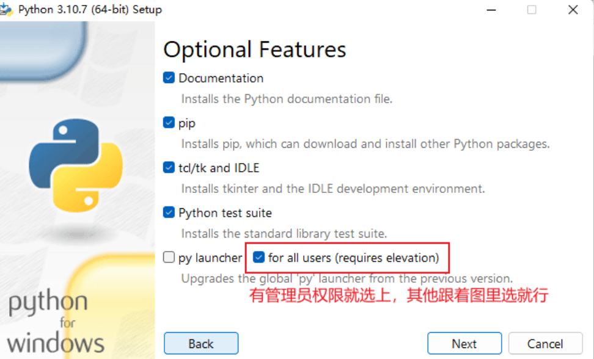
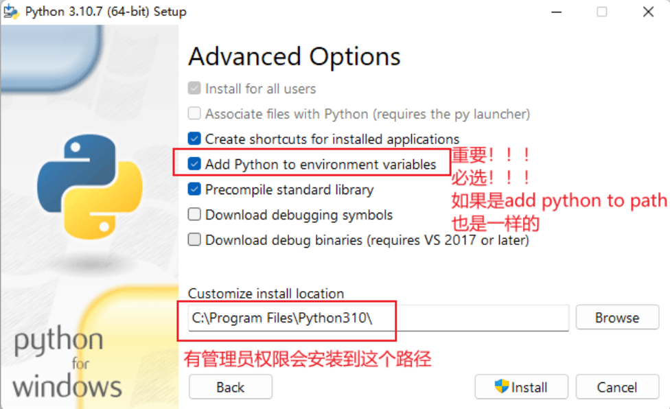
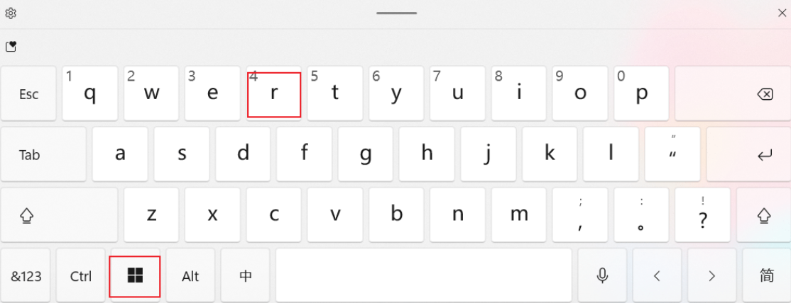
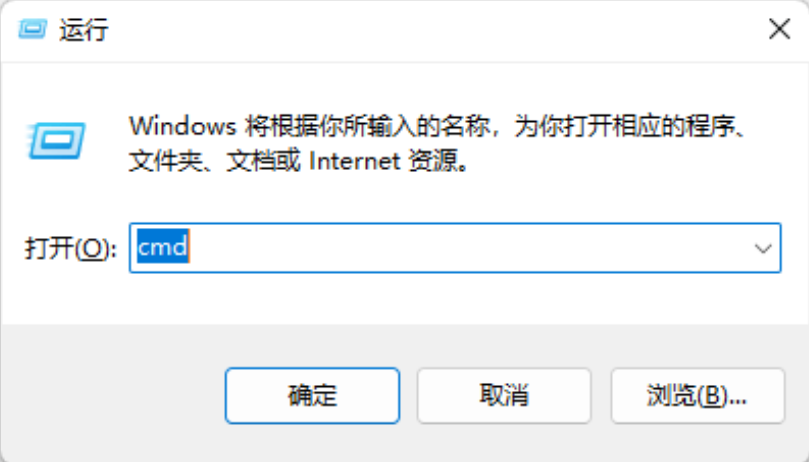
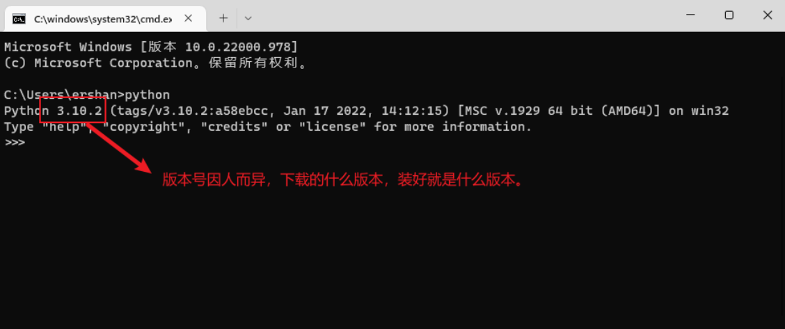

- Windows 下安装 Python 依赖当前操作系统的版本，具体可参考下表：
	- | windows | python |
	  | --- | --- |
	  | 8, 10, 11 | 可选择任意版本，学习用推荐 3.10 |
	  | 7 | < 3.9 |
	  | xp | < 3.4 |
- 具体安装流程如下：
	- Step 1. 打开浏览器输入 `https://www.python.org/`，或者直接点击[Python 官网](https://www.python.org/)
		- 
	- Step 2. 把鼠标放到 Downloads 处，这里会默认识别操作系统推荐相应的 Python 版本，如果没有特定需求，win8+ 用户直接通过此处下载即可。
		- 
	- Step 3. 如果 Step 2 不适用，点击 Downloads -> [Windows](https://www.python.org/downloads/windows/). 找到适合你的Python版本，选择方式参考上表。
		- 
		- 64 位的操作系统两个安装包都可以，建议安装 64 位；32 位的操作系统只能装32位。
		- [[查看操作系统是 64 位还是 32 位的方法]]
	- Step 4. 下载速度缓慢的解决方法
		- 如果下载缓慢，尝试使用下面两个网址直接搜索对应版本下载安装：
		- https://registry.npmmirror.com/binary.html?path=python/
		- https://mirrors.huaweicloud.com/python/
		- 
		- 
		- 下载以 msi 或者 exe 结尾的安装包文件（比较新版本的安装包可能是以exe结尾的）。
	- Step 5. 双击打开下载的安装包开始安装
		- 
		- 
		- 
	- Step 6. 验证安装是否成功
		- 
		- 按下win+r键打开运行。
		- 
		- 输入 cmd 按下回车，弹出一个黑框框，它叫终端（terminal）。在里面输入 Python，按下回车，出现如下界面则安装成功。
		- 
		- 上面的黑框框被称作 [[Python Shell]]
-