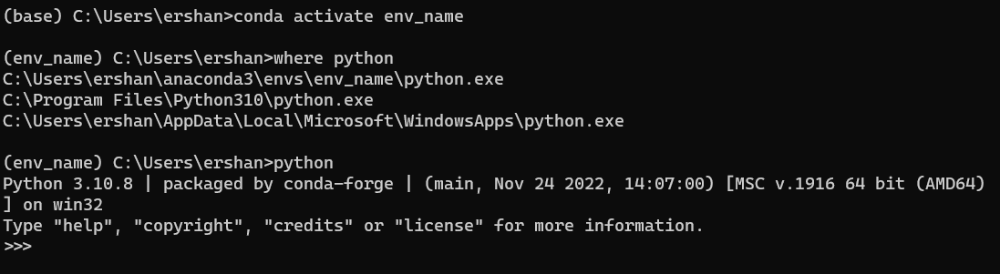
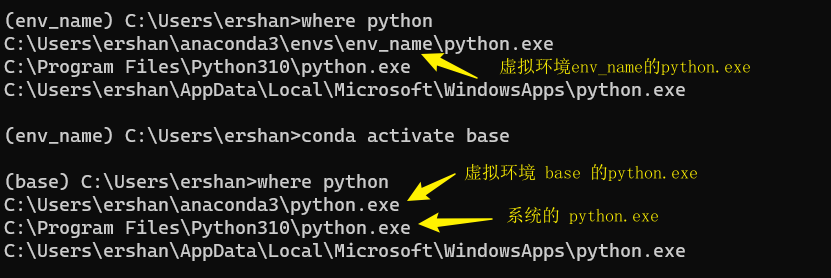
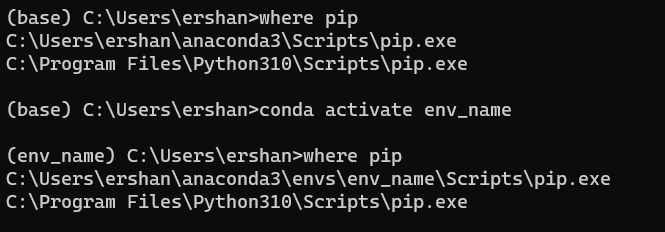

tags:: 基础笔记
title:: conda

- ## What
	- > Conda 是一个开源软件包管理系统，可用于安装、运行和管理复杂的软件包和依赖关系。它是为了解决软件包依赖问题而开发的，并且可以在多种操作系统上使用。
- ## Why
	- 管理和分发 Python 虚拟环境。
- ## How
	- ### 创建虚拟环境
		- 使用 `conda create` 命令创建虚拟环境：
		  ```sh
		  (base) > conda create -y -n test_env python=3.10
		  ```
		  其中 `-y` 表示 `--yes`，也就是自动确认中间的提问； `-n` 指定虚拟环境的名称；`python=3.11` 指定要安装的 Python 版本（可选，不写就安装 conda 默认的版本）。
	- ### 列出虚拟环境
		- 使用 `conda env list` 列出所有的虚拟环境，`*` 表示当前激活的虚拟环境：
		  ```sh
		  (base) > conda env list
		  # conda environments:
		  base                  *  C:\Users\ershan\anaconda3
		  env_name                 C:\Users\ershan\anaconda3\envs\env_name
		  ```
	- ### 激活虚拟环境
		- 使用 `conda activate` 加虚拟环境的名称激活特定虚拟环境，当前激活的虚拟环境会显示在终端提示符里
		  ```sh
		  > conda activate env_name
		  ```
		  
		- 不同的虚拟环境实际上只是不同的环境变量的值：
		  
		- 对于 `pip` 来说也是类似的：
		  
	- ### 安装第三方库
		- 有两种方法，一种是使用虚拟环境里的 `pip install`:
		  ```sh
		  (base) > pip install flask
		  (base) > pip uninstall flask
		  ```
		  另一种是使用 `conda install`:
		  ```sh
		  (base) > conda install flask
		  (base) > conda uninstall flask
		  ```
-