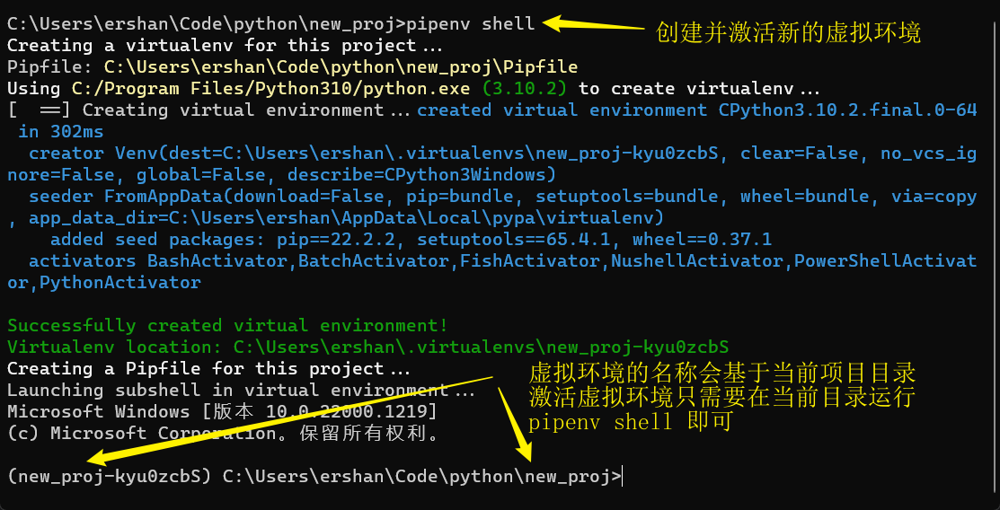
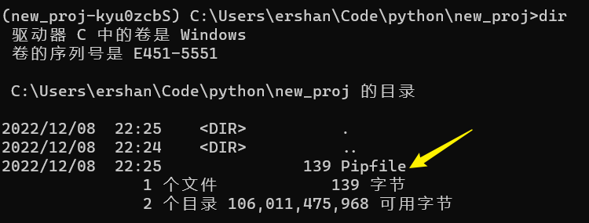
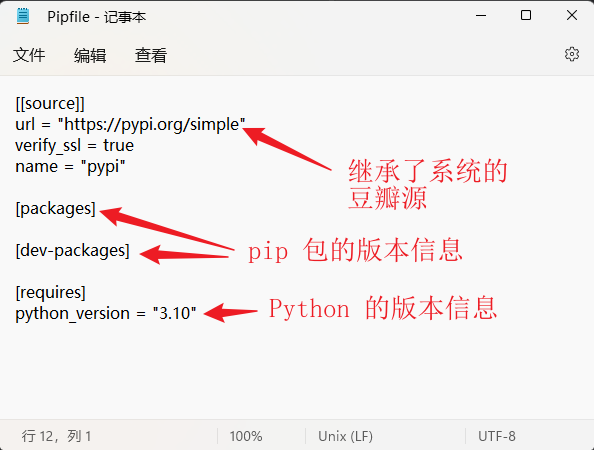
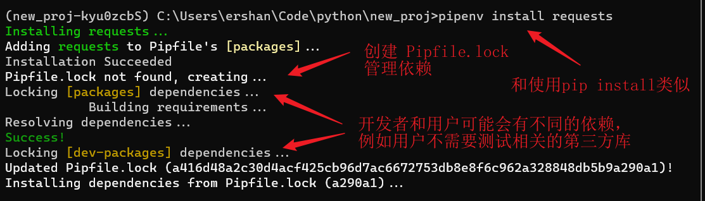
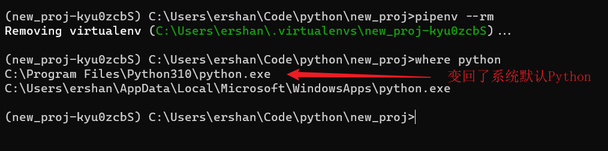

-
- ## What
	- > Pipenv 是一个用于管理 Python 包依赖和虚拟环境的工具。它通过一个 `Pipfile` 文件记录项目所依赖的所有包，并通过虚拟环境来隔离不同项目之间的依赖关系，避免冲突。使用 pipenv 可以更方便地管理 Python 项目的包依赖和虚拟环境。
- ## Why
	- Pipenv 相比于传统的 pip 和 virtualenv 的组合方式，更加方便和安全。
		- **便捷**：Pipenv 同时管理包依赖和虚拟环境，可以通过一条命令完成安装、更新、卸载等操作，大大简化了开发流程。
		  **易用**：Pipenv 会自动创建、更新和管理虚拟环境，不用手动配置和维护。
		  **安全**：Pipenv 可以自动检测并解决依赖冲突和漏洞问题，保证项目运行稳定和安全。
		  **可维护**：Pipenv 会自动生成 Pipfile 和 Pipfile.lock 文件，清晰记录项目的依赖关系和版本号，方便代码维护和协作。
- ## How
	- ### 安装 pipenv
		- ```sh
		  > pip install pipenv
		  ```
	- ### 给当前项目创建新的虚拟环境并激活
		- ```sh
		  > pipenv install
		  > pipenv shell --python /usr/bin/python #可以使用 --python 指定 python 解释器
		  ```
		- 
		- 这条命令会在当前目录下生成一个名为 Pipfile 的文件，记录项目的包依赖关系，同时创建一个虚拟环境，用于隔离不同项目之间的依赖。
		  
		  
	- ### 安装包
		- 在虚拟环境中安装包的方法与使用 [[pip]] 相同，只需在命令前面加上 [[pipenv]] 即可。例如安装 requests 库的命令如下：
		- ```sh
		  > pipenv install requests
		  ```
		- 
		- 这条命令会在当前项目的虚拟环境中安装 `requests` 库，同时在 [[Pipfile.lock]] 中记录依赖关系。
		- 如果想要禁用 Pipfile.lock（国内由于网络原因这个过程可能会很久），可以在运行 `pipenv install` 时使用 `--skip-lock` 参数，这样就可以安装最新的包版本而不更新 [[Pipfile.lock]] 。
	- ### 运行代码
		- 在虚拟环境中运行 Python 代码的方法与使用 [[virtualenv]] 相同，需要先激活虚拟环境，然后执行 Python 命令即可。激活虚拟环境的命令如下：
		- ```sh
		  > pipenv shell
		  ```
		- 之后就可以在当前终端里使用虚拟环境中的 Python 解释器和第三方库。
	- ### 退出虚拟环境
		- 在虚拟环境中执行 exit 命令即可：
		- ```sh
		  > exit
		  ```
	- ### 删除虚拟环境
		- 使用 `pipenv --rm` 即可删除当前项目目录对应的虚拟环境：
		- ```sh
		  > pipenv --rm
		  ```
		- 