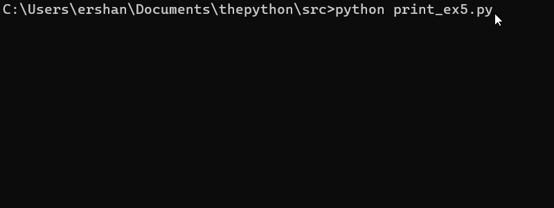

tags:: built-in, builtin_function_or_method

- ## 函数文档：
	- ```python
	  Docstring:
	  print(value, ..., sep=' ', end='\n', file=sys.stdout, flush=False)
	  
	  Prints the values to a stream, or to sys.stdout by default.
	  Optional keyword arguments:
	  file:  a file-like object (stream); defaults to the current sys.stdout.
	  sep:   string inserted between values, default a space.
	  end:   string appended after the last value, default a newline.
	  flush: whether to forcibly flush the stream.
	  Type:      builtin_function_or_method
	  ```
	- `print` 的功能是把 [[值]] 打印到 [[流]] 里，默认是 [[标准输出]]流，可以重定向到文件。
- ## 用法示例
	- ### 打印多个值
		- ```python
		  # print_ex1.py
		  name = 'ershan'
		  language = 'python'
		  print(name, 'loves', language, '!', 'x', 3)
		  ```
		- `print` 可以接收多个要打印的参数，并将其按照顺序打印。
		- ```sh
		  > python print_ex1.py
		  ershan loves python ! x 3
		  ```
	- ### 使用 `sep` 参数设定分隔符
		- ```python
		  # print_ex2.py
		  print(1, 2, 3)
		  print(1, 2, 3, sep=' ')
		  print(1, 2, 3, sep=',')
		  print(1, 2, 3, sep='-')
		  print(1, 2, 3, sep=', ')
		  ```
		- 可以使用 `sep` 参数设置特定的分隔符（可以是单字符，也可以是字符串），每个要打印的值之间会用该分隔符划分。
		- ```python
		  > python print_ex2.py
		  1 2 3
		  1 2 3
		  1,2,3
		  1-2-3
		  1, 2, 3
		  ```
		- `sep` 的默认值是单个空格 ` `（2， 3行打印结果相同）。
	- ### 使用 `end` 参数设定结尾符
		- ```python
		  # print_ex3.py
		  print('hello', end=' ')
		  print('world', end='!\n')
		  ```
		- 可以使用 `end` 参数设置特定的结尾。
		- ```python
		  > python print_ex3.py
		  hello world!
		  ```
	- ### 使用 `file`参数重定向流到文件
		- ```python
		  # print_ex4.py
		  with open('print_ex4.txt', 'w') as f:
		      print('hello world', file=f)
		  ```
		- 此处创建了一个可写的文件对象，使用 `file` 参数将打印结果重定向到文件。
		- ```python
		  > python print_ex4.py
		  > cat print_ex4.txt
		  hello world
		  ```
	- ### 使用 `flush` 刷新流
		- ```python
		  # print_ex5.py
		  import time
		  
		  for _ in range(10):
		      print('.', end='', flush=True)
		      time.sleep(.1)
		  
		  print('\ndone')
		  ```
		- 
-