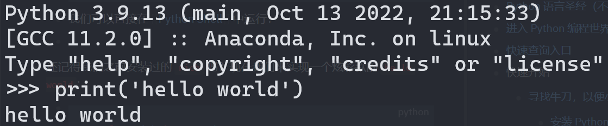
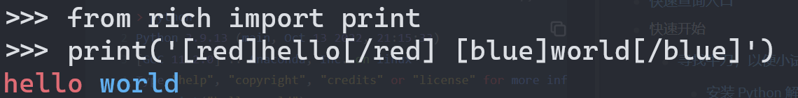
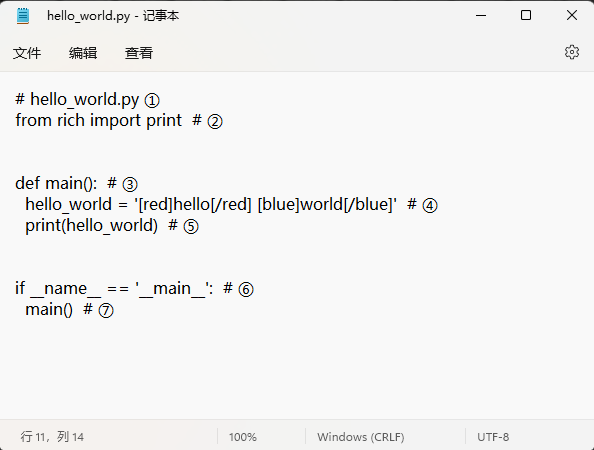
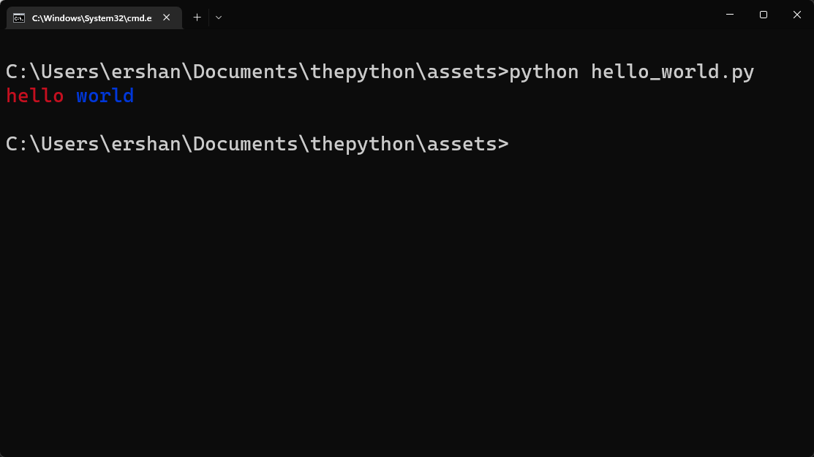

- 按照惯例，我们学习编程写下的第一个程序是打印 `hello world`。在 Python 中实现这个需求非常简单，只需要一行语句即可实现：
	- ```python
	  print('hello world')
	  ```
	- 我们可以直接在 [[python shell]] 中直接运行：
	- 
	- 在 Python 中一个函数可以被看作一个工具，能够执行特定的功能。例如上面 [[print]] 函数的作用就是打印给定的内容，默认是显示在屏幕上（也叫[[标准输出]]）。
	- 引号中的内容是一个 [[字符串]]的 [[字面量]] ，字符串是 Python 中的一种 [[数据类型]]。
	- `print` 叫做 [[函数]] 的名字，`print()`表示使用这个函数，在编程这个领域，专业点来说我们把**使用**叫做**调用**，跟在函数名后面的 `()` 叫做**调用操作符**。类比来看，假设 Python 世界有一个**工具**叫做`螺丝刀`，那么**使用螺丝刀上螺丝**在 Python 的世界中就被表示成`螺丝刀()`。括号里的内容被称为[[函数的参数]]，此处我们传递了一个[[字符串字面量]]作为`print`函数的参数。`print`函数将会把这个字符串打印到屏幕上。 #例子
	- 初学者常犯的一个错误就是只写函数名不调用，就跟你拿了一把螺丝刀啥也不干是一样滴。 #初学者避坑指南 #例子
	- 初学者常犯的另一个错误是**误用标点符号**，例如把上面字符串的引号写出了中文的 `‘’`，或者把括号写成中文的 `（）`。 #初学者避坑指南
		- {{embed ((6384dc36-19fe-4c08-a7b1-2c2ade9cc85f))}}
-
- 还记得我们之前安装过的 `rich` 吗？黑白的显示未免太过单调，现在我们来试着实现一个炫彩款的 `hello world`:
	- ```python
	  from rich import print
	  
	  print('[red]hello[/red] [blue]world[/blue]')
	  ```
	- 运行结果：
	- 
	- 第 1 行我们从 `rich` 中引入了 `print` 函数。
	- 第 3 行我们使用 `print` 打印了一个字符串，这个字符串里面使用了一个简单的标记语法`[red][/red]`给对应的单词添加颜色属性，然后运行程序的时候会显示对应的彩色输出。
-
- 不过我一直觉得上面的例子不太好，为了能够让你对 Python 有更多的第一印象，我参照 [[C 语言的 Hello World]] 改写了上面的例子：
	- ```python
	  # hello_world.py ①
	  from rich import print  # ②
	  
	  
	  def main():  # ③
	    hello_world = '[red]hello[/red] [blue]world[/blue]'  # ④
	    print(hello_world)  # ⑤
	    
	  
	  if __name__ == '__main__':  # ⑥
	    main()  # ⑦
	  ```
		- ① 在 Python 中使用 `#` 开头，表示当前行是一个注释，[[Python 解释器]]这个翻译官会忽视它，这一行实际是写给我们这些开发者看的。
		- ② 还记得我们在 [[认识 pip]]的时候安装的那个第三方库吗，没错就是它，我们通过 Python 的 `import` 系统引入了安装在操作系统磁盘中的第三方库 `rich` 提供的 `print` 方法。==在 Python 的眼里每个名字都是唯一的==，因此原本的 `print` 函数会被这个新来的给**覆盖**掉。
		- ③ `print` 这个工具是一个 [[内置]] 工具，属于开箱即用。如果我们想构建自己的工具，可以使用 `def` [[关键字]]。例如此处我们定义了一个工具叫做 `main`。`()`里啥都不写表示使用我们的工具不需要参数。后面跟着的一个 `:` 表示我们当前的 [[语句]] 没有写完，这种一个 [[逻辑行]] 写不完的语句被称为 [[复合语句]]。在 Python 中使用[[缩进]]表示 [[语句块]] 的归属，同一个复合语句下的具有相同缩进的语句隶属于同一个语句块。
		- ④ 接下来我们定义了一个变量 `hello_world`，其中`hello_world`是 [[变量名]] ，也被叫做[[标识符]]，而后面的 [[字符串字面量]] `'[red]hello[/red] [blue]world[/blue]'` 被称为 [[变量的值]] 。我们==可以通过变量名获取到对应的值==。
		- ⑤ 我们使用 `rich` 包里的 `print` 函数（和内置的 `print` 函数不同，因为新的把旧的给替换了）打印 `hello_world` 变量的值。第 `5, 6, 7` 行属于定义 `main` 函数的复合语句。`6, 7` 行属于同一个缩进层级，属于 `def` 复合语句的子语句块。
		- ⑥ `if`表示 [[条件语句]]，也是一个复合语句，后面会跟一个[[布尔表达式]] 。`__name__` 是 Python 中内置的一个特殊变量，它的值依赖我们是如何运行程序的。更多的细节可以参见 [[__name__]]。`==` 运算符将比较其两边的值是否相等，如果相等会返回一个布尔值 `True`，否则返回另一个布尔值 `False`。`True` 和 `False` 是[[布尔类型]]唯一的两个值。如果 `if` 语句后面的表达式求值的结果为 `True` 则执行 `if` 语句块中的内容，否则不执行。
		- ⑦ 我们在第 `5` 行定义了函数 `main`，在第 11 行调用函数 `main()`。
	- 上面的程序会按照顺序从上到下逐行运行，我们通过 `if __name__ == '__main__'` 显式的定义了**程序的入口**。因此真正执行我们程序逻辑——打印彩色 `hello world` 的语句，是从第 11 行开始的：Python 解释器搜索 `main` 函数的定义，接着跳转到第 5 行**进入**函数，执行第 6 行定义变量，第 7 行将其打印到屏幕上，然后从函数中返回，发现后面没有需要执行的语句，程序执行完退出。
	-
	- 在 [[什么是编程？]]中介绍了编程的定义，现在我们在一个文件 `hello_world.py` 中写了==一系列的描述特定步骤的语句==，是不是和之前的定义就匹配上啦。
		- 
	- 那么我们怎么运行它呢？我们需要告诉 Python 解释器去翻译哪个文件，所以执行方式如下所示：
		- 
-
- 上述这些知识点对于第一次接触编程的你来说可能有一些多，但是没关系，现在只要混个眼熟就可以啦，后面我们还会反反复复的接触这些概念，慢慢你就能逐个掌握它们了。