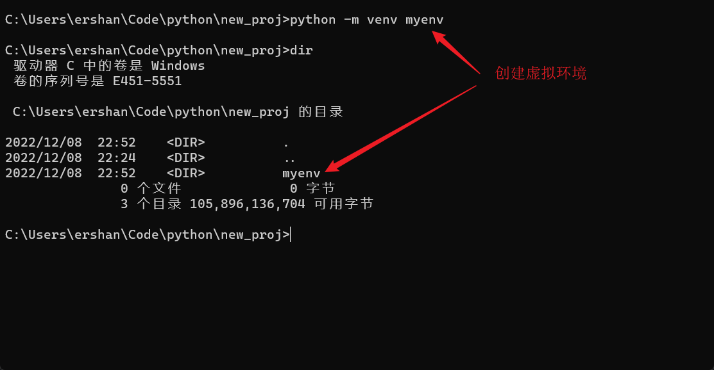
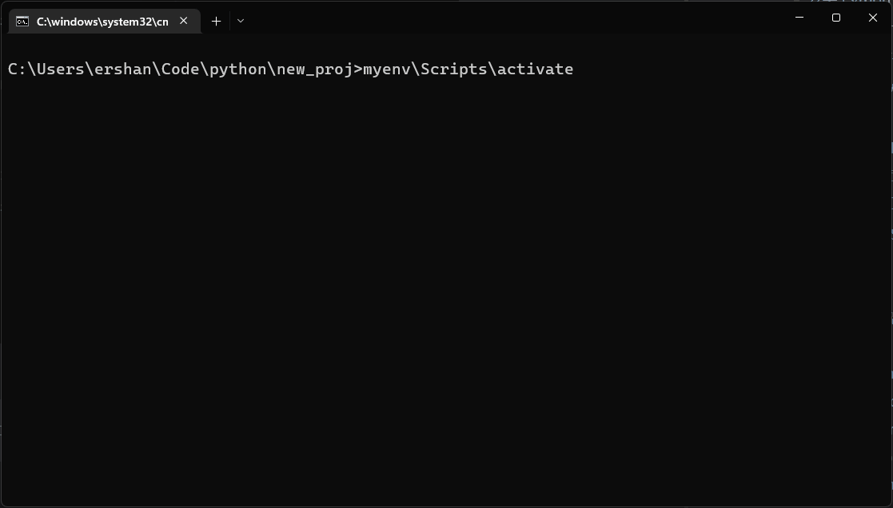
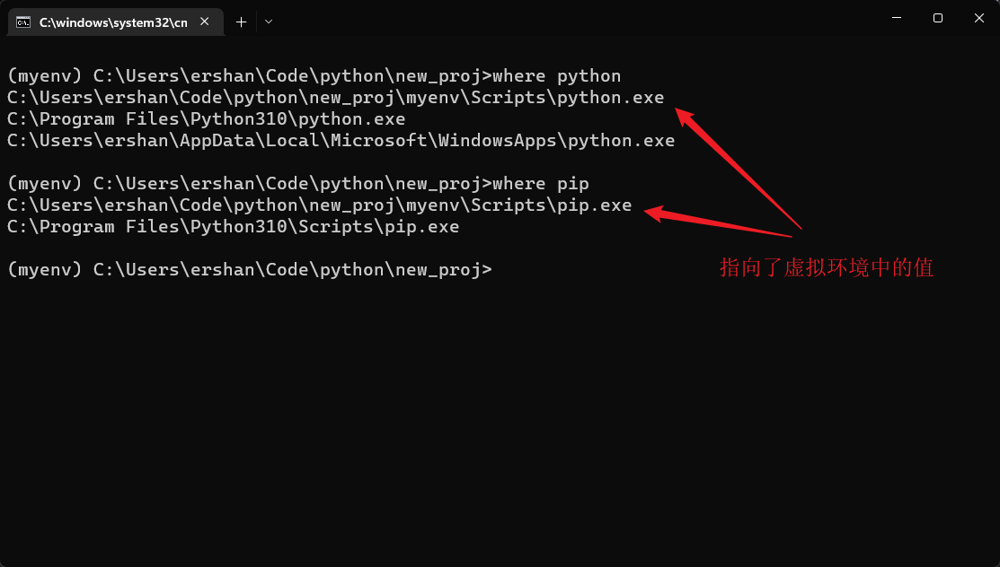
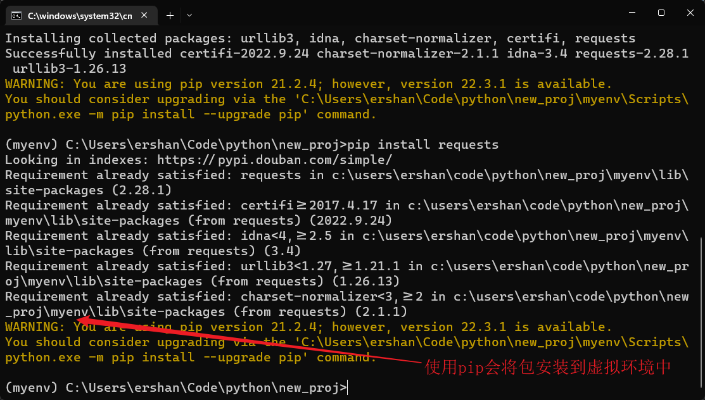
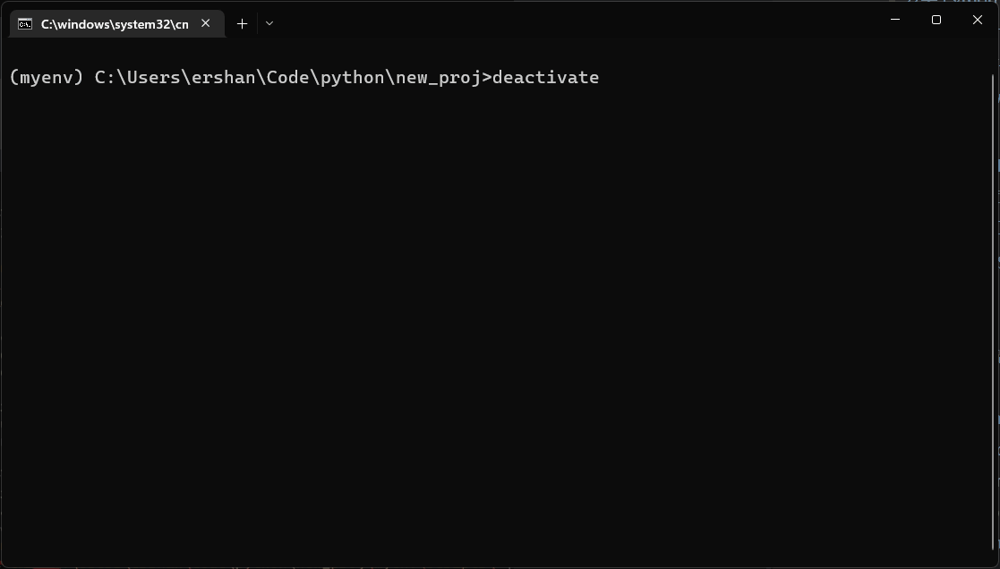

-
- ## What
	- venv 是 Python 标准库中提供的一个虚拟环境工具。使用它可以创建一个完整独立的 Python 环境，避免由于版本冲突带来的问题。
- ## Why
	- 标准库自带，不用额外安装
- ## How
	- ### 创建新的虚拟环境
		- ```
		  > python3 -m venv /path/to/new/virtual/environment
		  ```
		- 
	- ### 激活新创建的虚拟环境
		- ```
		  > source /path/to/new/virtual/environment/bin/activate
		  ```
		- 
		- 它会自动更改系统环境变量的值，使当前终端中的 python 解释器和 pip 的路径变为虚拟环境中的值。
		- 
	- ### 使用 pip 安装新的包
		- ```
		  > pip install requests
		  ```
		- 
	- ### 退出虚拟环境
		- 运行 `deactivate` 命令退出虚拟环境。
			- 
	- ### 删除虚拟环境
		- 直接删除整个目录即可