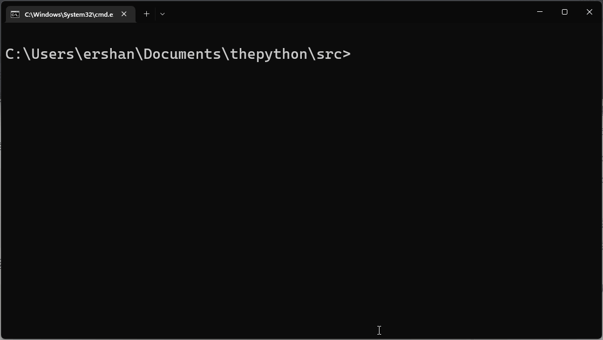

alias:: def statement
tags:: 函数, compound statement

- 在 Python 中使用 `def`关键字定义函数。 把**用户自定义函数**的语句称为[[函数定义语句]]。 #定义
  id:: 6389debc-2fe8-4116-9c72-81ff2f64ba57
	- ```python
	  >>> def say_hello():     # ①
	  ...     print("hello")   # ②
	  ...
	  >>> say_hello()          # ③
	  hello
	  ```
	- ① 函数定义语句是一个复合语句，由 `def` 关键字作为起始，后面跟**函数名称**，括号内表示[[函数参数]]，因为是复合语句，所以后面使用 `:`表示当前语句未结束。
	- ② 使用[[缩进]]表示当前语句是函数定义语句的子语句，整个缩进的代码块被称为[[函数体]]。 #定义
	- ③ 使用函数名 `say_hello` + 函数调用操作符 `()`调用函数，此处会执行函数体内的代码。
- 函数定义并不会执行函数体；只有当函数被调用时才会执行此操作。 #初学者避坑指南
  id:: 6389dfac-9e07-41a0-a626-d2d4e631183a
	- ```python
	  # func_ex1.py
	  def say_hello():
	      print("hello")
	  ```
	- 运行此程序不会有任何输出，因为这里只定义了函数，并没有调用它。
	- 
	- 因此运行程序不会有任何输出。