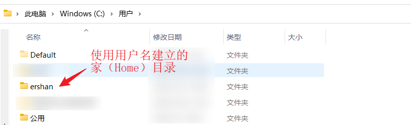

tags:: 基础笔记
alias:: user
title:: 用户

-
- ## What
	- 使用操作系统的人被称为[[用户]]。 #定义
	- 每一个[[用户]]有一个 [[账号]]。
	- [[用户]]是有[[权限]]的，常见的权限有：==读，写和执行==。
	- 对于 [[Windows]] 操作系统：
		- 可以从目录查看当前系统中用户的 [[家目录]] ：
			- 
			- 用户对于自己的家目录具有==读，写和执行==权限。
			- 所以在安装软件的时候通常会需要选择安装用户，因为普通用户是不能在其他用户或者管理员用户拥有的文件夹里写入内容的。而==安装这个过程需要拥有安装目录的写入权限==。